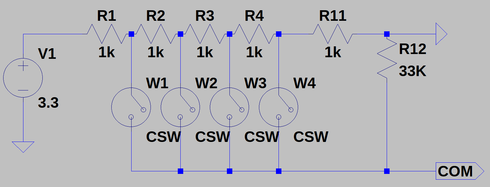

# Button ADC Driver for LVGL

This code implements a C library for handling buttons in embedded systems using ADC readings. These buttons are configured based on the circuit shown below



This circuit allows multiple readings from voltage dividers, each registered as a specific button. It's important to note that there is a 'range of values' associated with each button, depending on the specific circuit.

### File .h (button_adc_lvgl.h)

#### Data Types and Enumerations

1. `button_adc_config_t`: Structure that describes a button, with details such as the button number, ADC limits and state.

2. `button_state_t`: Enumeration representing the states or events of the button (Pressed, Released).
   
   #### Functions

3. `button_adc_init`: Initializes a button. First, the configuration parameters of the driver must be checked via `idf.py menuconfig`. Then, the buttons are declared using the `button_adc_config_t` structure. Finally, the `button_adc_init(&btnX)` function is called. 

4. `button_adc_deinit`: Deinit button

5. `button_adc_get_pressed_id`: Get the ID (0, 1, 2, ...) of the pressed button. Returns -1 if none

6. `button_adc_is_pressed`: Test if button is pressed or not. Returns True/False

7. `button_adc_init_test`: Display the ADC readings, so that the buttons can be configured later. In the case of using the 'button_adc_init_test()' testing,   the buttons should not be initialized; it only serves to obtain the values ​​of the buttons.

### Key Features

- Handling of multiple buttons with individual configurations.
- It only detects pressed or released, other events will be handled via LVGL
- Configuration of ADC limits for each button.
- Ability to perform button tests by visualizing ADC values through the terminal.

This summary provides an overview of the functions and features of the code.

### Usage

Add the `button_adc_lvgl` directory within the `components` directory.
Then, in the 'main' directory, in the CMakeLists.txt file,

register the component:

```cmake
idf_component_register(SRCS "main.c"
 INCLUDE_DIRS ".")
list(APPEND EXTRA_COMPONENT_DIRS components)
```

Afterward, include it in main.c:

```c
#include "button_adc_lvgl.h"
```

**NOTE**: Its necessary to configure parameters via `idf.py menuconfig`

```c
#include <stdio.h>
#include <esp_log.h>
#include "freertos/FreeRTOS.h"
#include "freertos/task.h"
#include "freertos/timers.h"

#include "button_adc_lvgl.h"

static const char *TAG = "button_example";

void app_main(void)
{

    button_adc_config_t btn1 = {
        .button_index = 1,
        .lower_limit = 400,
        .upper_limit = 800};
    button_adc_config_t btn2 = {
        .button_index = 2,
        .lower_limit = 1300,
        .upper_limit = 1500};


    button_adc_init(&btn1);
    button_adc_init(&btn2);

    while (1)
    {
        ESP_LOGI(TAG, "button_id = %i", button_adc_get_pressed_id());
        vTaskDelay(pdMS_TO_TICKS(50));
    }

}
```
